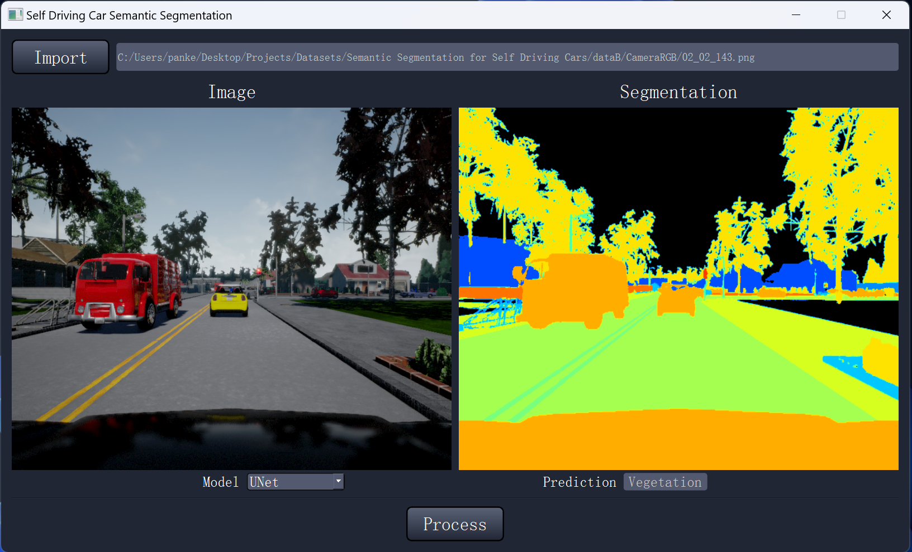
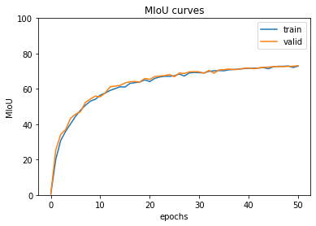

# Semantic Segmentation with UNet

This project aims to preform self driving Semantic Segmentation with UNet from Scratch.



### Dataset: 
[Kaggle lyft udacity challenge](https://www.kaggle.com/datasets/kumaresanmanickavelu/lyft-udacity-challenge)


### Build: 

	CPU: Intel i9-13900H (14 cores)
	GPU: NVIDIA RTX 4060 (VRAM 8 GB)
	RAM: 32 GB


### Training Curves

<p align="center">
  
  
</p>

<p align="center">
  
</p>


### Code Structure:
```bash
├── GUI.py (Run to generate a GUI)
├── main.py (Run to train model)
├── unet.py
├── qt_main.ui
├── training.py
├── summary.py
├── visualization.py

```

### Credits:
	"U-Net: Convolutional Networks for Biomedical Image Segmentation"


	